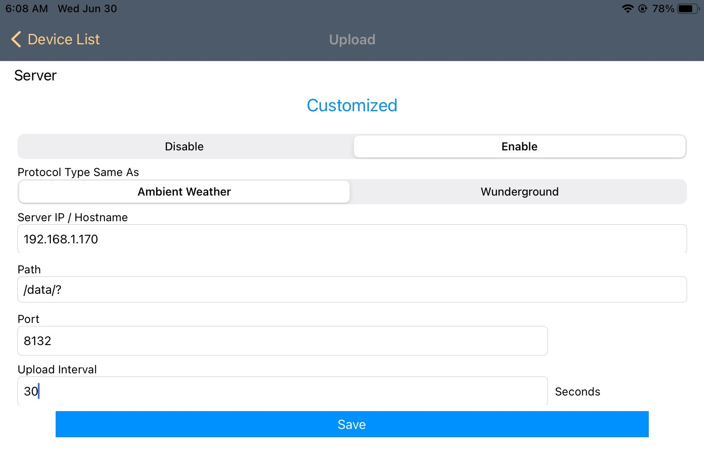
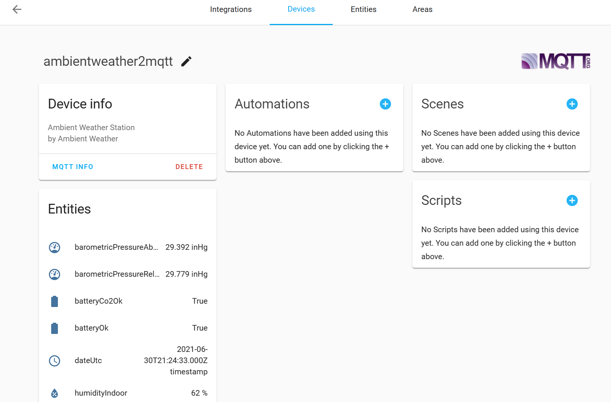

# ambientweather2mqtt

This package listens for local data from Ambient Weather stations (such as the WS-2902C) and converts the incoming data to MQTT events. The sensor data is published with auto-discovery so they show up automatically as sensors in Home Assistant.

The following Ambient Weather station models are confirmed to work:

- WS-2902C

## Installation and configuration

### Setting up the Docker image

The package is provided as a Docker image for ease of installation. The
[sampleConfiguration](sampleConfiguration/) folder contains the two files necessary
for setup.

1. Copy the [sampleConfiguration/.env](sampleConfiguration/.env) and
   [sampleConfiguration/docker-compose.yml](sampleConfiguration/docker-compose.yml)
   file to your local machine.
2. Edit the `.env` file and specify the required information. At a minimum you
   must provide the address of your MQTT server, your Ambient Weather station's MAC
   address, and the timezone your station is located in. The sample `.env` contains
   comments explaining the additional options available including username and password for connecting to the MQTT server.
3. Start up the service by running `docker compose up` in the same folder as two downloaded configuration files.

If the server starts up successfully you will see log messages like this:

```console
2021-06-30T05:59:56-07:00 [Main] Starting up
2021-06-30T05:59:56-07:00 [MQTT] Connected to MQTT server http://192.168.1.172:1883
2021-06-30T05:59:56-07:00 [Web server] Listening at http://localhost:8080
```

### Configuring the weather station

Your Ambient Weather station must be configured to send data to the local service. This configuration is done through the [`awnet`](https://apps.apple.com/us/app/awnet/id1341994564) app, and currently can only be configured using the app on iOS devices (the setting is not available in the Android app).

1. Run the `awnet` app and connect to your weather station.
2. Tap `next` through the configuration screens until you get to the `Customized`
   screen.
3. Set the fields to the values in the following table.
4. Tap `Save`.

| Field                 | Value                                                           | Notes                                                                                                                                       |
| --------------------- | --------------------------------------------------------------- | ------------------------------------------------------------------------------------------------------------------------------------------- |
| Enable/Disable        | Enable                                                          | Make sure to set this to `Enable` otherwise no data will get sent.                                                                          |
| Protocol Type Same As | Ambient Weather                                                 |                                                                                                                                             |
| Server IP / Hostname  | The IP or hostname for the machine running the Docker container |                                                                                                                                             |
| Path                  | `/data/?`                                                       | **It is very important this field is entered exactly as shown. Be very careful to include the `?` at the end otherwise nothing will work.** |
| Port                  | The port specified in the `.env` file                           | The sample `.env` file provided uses `8132` so unless you changed it to something else you should enter `8132` here.                        |
| Upload Interval       | The frequency to send the data.                                 | `30` is a reasonable value to start with.                                                                                                   |

Here is what a properly configured weather station looks like:



## Verifying everything works

To verify everything works connect to your Home Assistant server and go to
_Configuration_ > _Devices_ and search for _ambientweather2mqtt_. You should
see a list of all the sensors with current values reported.



## Troubleshooting

If you see the list of sensors but they all report `Unavailable` for the value it
means the data from the weather station is not being received by this system.
Check the following:

1. The `Server IP / Hostname` value was set to the correct IP address for the Docker
   system.
2. The `Port` value was set to the same value specified in `.env`.
3. The `Path` value was set to `/data/?` **with the question mark at the end**. If the question mark is missing the system will not work.
4. Your firewall rules aren't blocking communication from your weather station
   to your Docker server. This can happen if you run virtual LANs to segment NoT/IoT
   traffic from your primarily LAN.

## Supported sensors

The following sensors are supported:

| Name                       | Description                               | Unit    |
| -------------------------- | ----------------------------------------- | ------- |
| barometricPressureAbsolute | Absolute barometric pressure              | inHg    |
| barometricPressureRelative | Relative barometric pressure              | inHg    |
| batteryCo2Ok               | State of the CO2 device battery           | boolean |
| batteryOk                  | State of the device battery               | boolean |
| dateUtc                    | Date of the latest measurements           | date    |
| humidityIndoor             | Indoor humidity                           | percent |
| humidityOutdoor            | Outdoor humidity                          | percent |
| rainDaily                  | Daily rain                                | inches  |
| rainEvent                  | Event rain                                | inches  |
| rainHourly                 | Hourly rain                               | inches  |
| rainMonthly                | Monthly rain                              | inches  |
| rainTotal                  | Total rain since last factory reset       | inches  |
| rainWeekly                 | Weekly rain                               | inches  |
| solarRadiation             | Solar radiation                           | W/m^2   |
| temperatureIndoor          | Indoor temperature                        | °F      |
| temperatureOutdoor         | Outdoor temperature                       | °F      |
| uv                         | UV radiation index                        | integer |
| windGust                   | Maximum wind speed in the last 10 minutes | mph     |
| windMaxDailyGust           | Maximum wind speed in last day            | mph     |
| windSpeed                  | Instantaneous wind speed                  | mph     |
